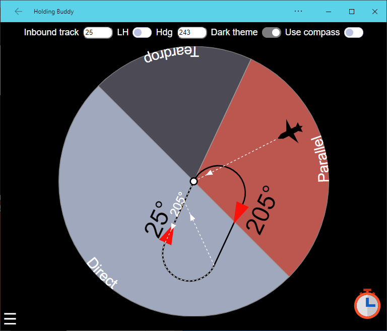

# holdingbuddy

## A PWA/webapp to help with holding pattern entry procedures
https://icalder.github.io/holdingbuddy/

## Touch-screen features
 - *Rotate* to set holding pattern inbound track
 - *Swipe* left/right to change hold orientation
 - *Touch* to position aircraft

## Development
Run these commands, then browse to http://localhost:3000
```
npm install
# In one terminal
npm run rollup
# In another terminal
npm run serve
```

## Credits
Thanks go to these excellent libraries:
 - [SVG.js](https://svgjs.com/docs/3.0/)
 - [Hammer.JS](https://hammerjs.github.io/)


